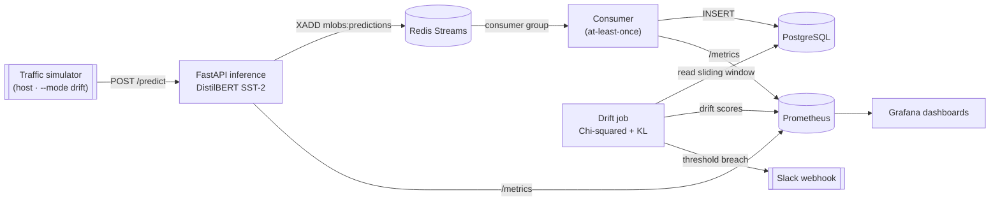
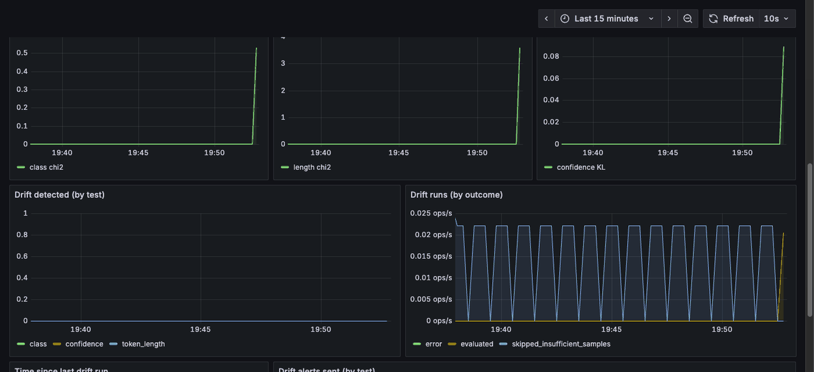

# ML Observability System

[](https://github.com/MuratAlkan06/ml-observability-system/actions/workflows/ci.yml)
[](https://www.python.org/downloads/release/python-3120/)
[](LICENSE)

Real-time ML observability for a self-hosted sentiment model, treated like production
infrastructure. A FastAPI service runs DistilBERT (SST-2 sentiment) inference and streams
every prediction through Redis Streams into PostgreSQL; a drift job continuously compares the
latest-500-prediction window against a frozen baseline using three statistical tests — class
χ², token-length χ², and confidence KL divergence — and alerts to Slack when the input
distribution shifts. Request latency, pipeline throughput, and drift scores are all exported to
Prometheus and visualized in Grafana, and a host-side traffic simulator with a `--mode drift`
switch can trip all three detectors on demand. It is a compact, end-to-end demonstration of the
observability that real ML systems need but rarely ship with.

## Architecture



All services run under Docker Compose on a single node. Only the API (`:8000`) and Grafana
(`:3000`) are published for normal use; Prometheus (`:9090`) is bound to loopback for local
debugging, and the consumer (`:9108`) and drift (`:9109`) metrics endpoints are scraped over the
internal Compose network and never published to the host.

## Demo



Healthy traffic keeps all three drift statistics well below their thresholds. Switching the
simulator to `--mode drift` saturates the sliding window with out-of-distribution reviews, and
within one 60-second evaluation cycle the class χ², token-length χ², and confidence-KL panels
spike past their thresholds while the **Drift detected** panel flips on and drift runs switch
from *skipped* to *evaluated*.

## Quick start

Prerequisites: Docker + Docker Compose, and Python 3.12 on the host for the traffic simulator.

```bash
# 1. Clone
git clone https://github.com/MuratAlkan06/ml-observability-system.git
cd ml-observability-system

# 2. Configure secrets (never committed — .env is gitignored)
cp .env.example .env
#   Edit .env and set at minimum:
#     POSTGRES_PASSWORD   (any strong value; applied at first initdb)
#     GF_ADMIN_PASSWORD   (Grafana admin; the stack refuses to start if unset)
#   Optional: SLACK_WEBHOOK_URL (empty disables alerting), GF_ADMIN_USER.

# 3. Build and start the stack
docker compose up -d --build

# 4. Drive traffic from the host (simulator needs only httpx)
python -m venv .venv && . .venv/bin/activate
pip install httpx
python -m src.simulator --mode normal          # healthy baseline traffic
python -m src.simulator --mode drift            # trips all three drift tests
#   Useful flags: --rate <rps> (default 5), --count <N> (default: run until Ctrl-C).
```

Then look at:

| Where | URL | Notes |
| --- | --- | --- |
| Grafana dashboards | http://localhost:3000 | Anonymous **Viewer** — no login. *mlobs — API & Inference* and *mlobs — Pipeline & Drift*. |
| API docs (Swagger) | http://localhost:8000/docs | `POST /predict`, `GET /health`, `GET /metrics`. |
| Prometheus | http://localhost:9090 | Loopback-only (SSH-tunnel off-box). |

## Load test

Measured **on the deployed EC2 t3.medium** (2 vCPU, us-west-2, Ubuntu 24.04, Docker Compose,
single uvicorn worker) with [`hey`](https://github.com/rakyll/hey) `0.1.5` run on-instance over
loopback — 15 s warm-up to prime the model, then 60 s measured runs of a 26-token
positive-review payload:

> **≈14.7 req/s sustained, p95 85 ms on EC2 t3.medium — 0 errors.**

| Concurrency | Throughput | p50 | p95 | p99 | Errors |
| --- | --- | --- | --- | --- | --- |
| 1 | 14.72 req/s | 63.5 ms | 84.6 ms | 185.9 ms | 0 |
| 2 | 14.74 req/s | 126.7 ms | 197.9 ms | 390.6 ms | 0 |
| 4 | 14.77 req/s | 254.3 ms | 331.6 ms | 691.1 ms | 0 |

Throughput is flat across c=1/2/4 while latency scales linearly — the single-worker, CPU-only
inference path is the ceiling, so added concurrency just queues. CPU held ~66% avg / 86% max
during the runs. The instance ran in **unlimited CPU-credit mode**, so these reflect full burst
rather than a throttled t3 baseline.

For reference, the same methodology run **locally** on an Apple M4 Pro (Docker Desktop, 14-vCPU
VM) sustains **28.8 req/s at p95 37 ms** (concurrency 1, `torch.set_num_threads(2)`, 0 errors) —
roughly 2× the EC2 throughput, as expected from the wider host.

Reproduce (short warm-up primes the model, then the measured 60-second run; vary `-c` for
concurrency):

```bash
PAYLOAD='{"text":"A thrilling, moving, and beautifully acted film."}'
# warm-up
hey -z 15s -c 1 -m POST -T "application/json" -d "$PAYLOAD" http://localhost:8000/predict
# measured
hey -z 60s -c 1 -m POST -T "application/json" -d "$PAYLOAD" http://localhost:8000/predict
```

## How drift detection works

The drift job wakes every **60 s**, reads the **latest 500** predictions for the current model
version, and — if the window has at least **200** samples — runs three independent tests against
the frozen `baseline/baseline.json` (built from the 872-row SST-2 validation split). Any single
positive result marks the run as drift-detected:

| Test | Statistic | Fires when |
| --- | --- | --- |
| Class balance | χ², df = 1 | stat > **6.635** |
| Token-length distribution | χ² over 5 frozen bins, df = 4 | stat > **13.277** |
| Confidence distribution | KL(window ‖ baseline) over 10 frozen bins | > **0.10 nats** |

Critical values are hard-coded at α = 0.01 (no SciPy/NumPy — the math is pure Python). Each run
is persisted to the `drift_runs` table and exported to Prometheus; when `SLACK_WEBHOOK_URL` is
set, a breach posts to Slack (with a 15-minute per-test cooldown). The host simulator ships two
corpora selected by `--mode`: `normal` traffic tracks the baseline on all three axes and fires
nothing, while `drift` traffic is engineered to trip all three tests simultaneously once it
saturates the window.

## Stack

| Layer | Technology |
| --- | --- |
| Inference API | FastAPI (single uvicorn worker) |
| Model | DistilBERT SST-2, baked into the image; `tokenizers==0.22.2` pinned |
| Event stream | Redis Streams (`mlobs:predictions`, consumer group `pg_writer`) |
| Storage | PostgreSQL 16 |
| Drift detection | Pure-Python χ² + KL against a frozen baseline |
| Metrics | Prometheus |
| Dashboards | Grafana (anonymous Viewer) |
| Orchestration | Docker Compose |
| Language | Python 3.12 |

## Roadmap

Built in waves of independently reviewable slices.

- [x] **Wave 1 — A · Reset & scaffold** — legacy stubs removed, frozen plan adopted, CI + tooling in place

**Wave 2 — parallel slices**
- [x] **S1 · Inference service** — FastAPI app, self-hosted model load, `POST /predict`, `GET /health`, `GET /metrics`
- [x] **S2 · Event pipeline** — Redis Streams producer → consumer group → PostgreSQL, at-least-once with idempotent writes
- [x] **S3 · Drift detection** — frozen baseline vs sliding window, Chi-squared + KL divergence, Prometheus export, Slack alerting
- [x] **S4 · Simulator + dashboards** — host-side traffic generator with drift injection, provisioned Grafana dashboards

**Wave 3**
- [x] **S5 · End-to-end + load test** — full integration demo (above) and local load test
- [x] **S5 · Deploy** — single-node EC2 t3.medium (Docker Compose, Ubuntu 24.04); only `:8000`
  and `:3000` exposed, IMDSv2 enforced. Live-verified on the instance: exactly-once pipeline at
  ~4.7k predictions and all three drift tests firing real Slack alerts.

## Frozen specification

The complete frozen v1 design — scope contract, HTTP/event/DB schemas, drift spec, Prometheus
metric inventory, and verification matrix — lives in [`docs/PLAN.md`](docs/PLAN.md).
Implementation slices build against it verbatim.

## License

[MIT](LICENSE)
