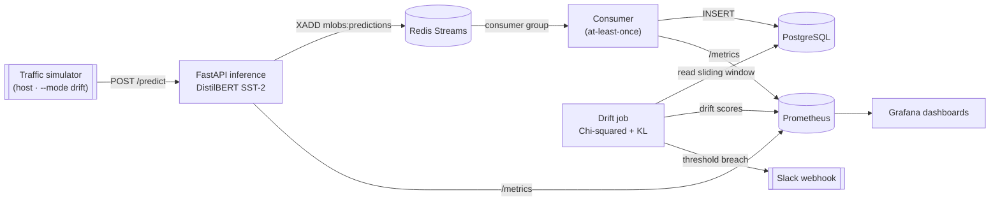

# ML Observability System

Self-hosted ML inference + event pipeline + statistical drift detection + observability stack.

> 🚧 **v1 in progress — building in public.** Nothing below exists yet unless it is checked in the [roadmap](#roadmap). This repo is scaffold-first: the frozen design lands before the code. The complete, frozen v1 specification lives in [`docs/PLAN.md`](docs/PLAN.md).

## What it will be

A single-node platform that will serve a self-hosted sentiment model, stream every prediction through an event pipeline into durable storage, and continuously watch live traffic for statistical drift — surfacing everything through Prometheus/Grafana and alerting to Slack when the input distribution shifts. A host-side traffic simulator with an optional drift-injection mode will drive the whole thing for demos.

## Planned architecture

## Planned stack

| Layer | Technology |
| --- | --- |
| Inference API | FastAPI |
| Model | DistilBERT (SST-2 sentiment) |
| Event stream | Redis Streams |
| Storage | PostgreSQL |
| Metrics | Prometheus |
| Dashboards | Grafana |
| Orchestration | Docker Compose |
| Language | Python 3.12 |

## Roadmap

Built in waves of independently reviewable slices. Unchecked items are **not built yet**.

- [x] **Wave 1 — A · Reset & scaffold** ✅ — legacy stubs removed, frozen plan adopted, CI + tooling in place

**Wave 2 — parallel slices**

- [ ] **S1 · Inference service** — FastAPI app, self-hosted model load, `POST /predict`, `GET /health`, `GET /metrics`
- [ ] **S2 · Event pipeline** — Redis Streams producer → consumer group → PostgreSQL, at-least-once with idempotent writes
- [ ] **S3 · Drift detection** — frozen baseline vs sliding window, Chi-squared + KL divergence, Prometheus export, Slack alerting
- [x] **S4 · Simulator + dashboards** — host-side traffic generator with drift injection, provisioned Grafana dashboards

**Wave 3**

- [ ] **S5 · End-to-end + deploy** — full integration demo, load test, single-node deployment

## Frozen specification

The complete frozen v1 design — scope contract, HTTP/event/DB schemas, drift spec, Prometheus metric inventory, and verification matrix — lives in [`docs/PLAN.md`](docs/PLAN.md). Implementation slices build against it verbatim.

## License

[MIT](LICENSE)
