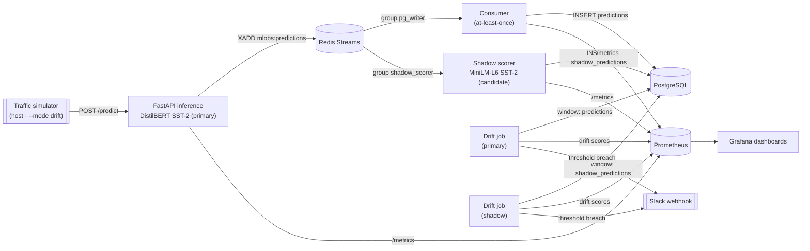
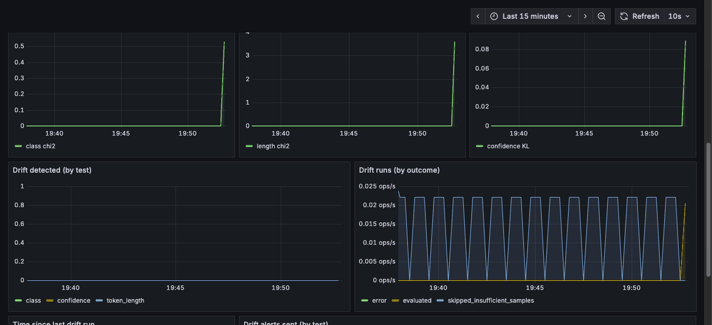

# ML Observability System

[](https://github.com/MuratAlkan06/ml-observability-system/actions/workflows/ci.yml)
[](https://www.python.org/downloads/release/python-3120/)
[](LICENSE)

Real-time ML observability for a self-hosted sentiment model, treated like production
infrastructure. A FastAPI service runs DistilBERT (SST-2 sentiment) inference and streams
every prediction through Redis Streams into PostgreSQL; a drift job continuously compares the
latest-500-prediction window against a frozen baseline using three statistical tests — class
χ², token-length χ², and confidence KL divergence — and alerts to Slack when the input
distribution shifts. Request latency, pipeline throughput, and drift scores are all exported to
Prometheus and visualized in Grafana, and a host-side traffic simulator with a `--mode drift`
switch can trip all three detectors on demand. A second, smaller **candidate model** scores the
same live traffic in a shadow deployment, so agreement, confidence deltas, latency, and per-model
drift can be compared side by side to support a data-driven promote-or-hold decision — with
near-zero impact on the primary prediction path as certified under Docker Compose (under the
current k3s runtime the delta is published as measured; see the k3s re-measurement section). It is a compact, end-to-end demonstration of the
observability that real ML systems need but rarely ship with.

Engineering rules binding every contributor — human or agent — live in
[PRINCIPLES.md](PRINCIPLES.md).

## Architecture


```mermaid
flowchart LR
    sim[["Traffic simulator<br/>(host · --mode drift)"]] -->|POST /predict| api["FastAPI inference<br/>DistilBERT SST-2 (primary)"]
    api -->|XADD mlobs:predictions| redis[("Redis Streams")]
    redis -->|group pg_writer| consumer["Consumer<br/>(at-least-once)"]
    redis -->|group shadow_scorer| shadow["Shadow scorer<br/>MiniLM-L6 SST-2 (candidate)"]
    consumer -->|INSERT predictions| pg[("PostgreSQL")]
    shadow -->|INSERT shadow_predictions| pg
    drift["Drift job<br/>(primary)"] -->|window: predictions| pg
    drifts["Drift job<br/>(shadow)"] -->|window: shadow_predictions| pg
    drift -->|drift scores| prom[("Prometheus")]
    drifts -->|drift scores| prom
    drift -->|threshold breach| slack[["Slack webhook"]]
    drifts -->|threshold breach| slack
    api -->|/metrics| prom
    consumer -->|/metrics| prom
    shadow -->|/metrics| prom
    prom --> graf["Grafana dashboards"]
```

All services run on a single node: under k3s on the EC2 host since 2026-09-27 (see
[Deployment](#deployment)), and in a local k3d cluster shaped like it in the quick start below.
Only the API (`:8000`) and Grafana
(`:3000`) are published for normal use; Prometheus (`:9090`) is reached through
`kubectl port-forward` for debugging, and the consumer (`:9108`), drift (`:9109`), and
shadow-scorer (`:9110`) metrics endpoints — plus the second `drift-shadow` job — are scraped over
in-cluster Services and never published to the host. The shadow scorer joins the same
`mlobs:predictions` stream with its **own consumer group**, so it never touches the primary
prediction path.

## Demo



Healthy traffic keeps all three drift statistics well below their thresholds. Switching the
simulator to `--mode drift` saturates the sliding window with out-of-distribution reviews, and
within one 60-second evaluation cycle the class χ², token-length χ², and confidence-KL panels
spike past their thresholds while the **Drift detected** panel flips on and drift runs switch
from *skipped* to *evaluated*.

## Quick start

The stack runs locally in a k3d cluster shaped like the host: the same pinned k3s image and
flags, the same `apply.sh` and `smoke.sh` the `K3sSmoke` CI job runs. The cluster command, the
image builds and the pins live in one place,
[Rehearsing locally with k3d](deploy/k3s/README.md#rehearsing-locally-with-k3d), and are not
copied here.

Prerequisites: Docker, `kubectl` and k3d (the recipe pins its version), roughly 20GB of free
disk, and Python 3.12 on the host for the traffic simulator.

```bash
# 1. Clone
git clone https://github.com/MuratAlkan06/ml-observability-system.git
cd ml-observability-system

# 2. Configure secrets (never committed — .env is gitignored; apply.sh reads it)
cp .env.example .env
#   Edit .env and set at minimum:
#     POSTGRES_PASSWORD   (any strong value; applied at first initdb)
#     GF_ADMIN_PASSWORD   (Grafana admin; apply.sh refuses to deploy if unset)
#   Optional: SLACK_WEBHOOK_URL (empty disables alerting), GF_ADMIN_USER.

# 3. Create the cluster, build and import the five images, and deploy: steps
#    1-5 of the k3d recipe in deploy/k3s/README.md. apply.sh ends by running
#    smoke.sh. The shadow scorer and the second drift job run by default, so
#    the model-comparison feature populates out of the box.

# 4. Drive traffic from the host (simulator needs only httpx)
python -m venv .venv && . .venv/bin/activate
pip install httpx
python -m src.simulator --mode normal          # healthy baseline traffic
python -m src.simulator --mode drift            # trips all three drift tests
#   Useful flags: --rate <rps> (default 5), --count <N> (default: run until Ctrl-C).

# 5. Tear down (step 6 of the recipe)
k3d cluster delete mlobs-dev
```

Then look at:

| Where | URL | Notes |
| --- | --- | --- |
| Grafana dashboards | http://localhost:3000 | Anonymous **Viewer** — no login. *mlobs — API & Inference*, *mlobs — Pipeline & Drift*, and *mlobs — Model Comparison*. |
| API docs (Swagger) | http://localhost:8000/docs | `POST /predict`, `GET /health`, `GET /metrics`. |
| Prometheus | http://localhost:9090 | Not published: run `kubectl -n mlobs port-forward svc/prometheus 9090:9090` first. |

## Load test

*Historical: measured under Docker Compose on the EC2 t3.medium. The runtime is k3s as of
2026-09-27 — see [k3s re-measurement](#k3s-re-measurement-2026-09-27) and [docs/K3S.md](docs/K3S.md).*

Measured **on the deployed EC2 t3.medium** (2 vCPU, us-west-2, Ubuntu 24.04, Docker Compose,
single uvicorn worker) with [`hey`](https://github.com/rakyll/hey) `0.1.5` run on-instance over
loopback — 15 s warm-up to prime the model, then 60 s measured runs of a 26-token
positive-review payload:

> **≈14.7 req/s sustained, p95 85 ms on EC2 t3.medium — 0 errors.**

| Concurrency | Throughput | p50 | p95 | p99 | Errors |
| --- | --- | --- | --- | --- | --- |
| 1 | 14.72 req/s | 63.5 ms | 84.6 ms | 185.9 ms | 0 |
| 2 | 14.74 req/s | 126.7 ms | 197.9 ms | 390.6 ms | 0 |
| 4 | 14.77 req/s | 254.3 ms | 331.6 ms | 691.1 ms | 0 |

Throughput is flat across c=1/2/4 while latency scales linearly — the single-worker, CPU-only
inference path is the ceiling, so added concurrency just queues. CPU held ~66% avg / 86% max
during the runs. The instance ran in **unlimited CPU-credit mode**, so these reflect full burst
rather than a throttled t3 baseline.

For reference, the same methodology run **locally** on an Apple M4 Pro (Docker Desktop, 14-vCPU
VM) sustains **28.8 req/s at p95 37 ms** (concurrency 1, `torch.set_num_threads(2)`, 0 errors) —
roughly 2× the EC2 throughput, as expected from the wider host.

Reproduce (short warm-up primes the model, then the measured 60-second run; vary `-c` for
concurrency):

```bash
PAYLOAD='{"text":"A thrilling, moving, and beautifully acted film."}'
# warm-up
hey -z 15s -c 1 -m POST -T "application/json" -d "$PAYLOAD" http://localhost:8000/predict
# measured
hey -z 60s -c 1 -m POST -T "application/json" -d "$PAYLOAD" http://localhost:8000/predict
```

### v1.1 load test (shadow on/off)

*Historical: measured under Docker Compose on the EC2 t3.medium. The runtime is k3s as of
2026-09-27 — see [k3s re-measurement](#k3s-re-measurement-2026-09-27) and [docs/K3S.md](docs/K3S.md).*

Certified **on the deployed EC2 t3.medium** (2 vCPU / 4 GB, single uvicorn worker) with
[`hey`](https://github.com/rakyll/hey) driving `POST /predict` on a fixed ~15-token review
sentence at the **5 rps demo rate**, warm steady state, over matched **120-second** windows —
shadow scorer **on** vs. **off** (`docker compose stop shadow-scorer`):

> **Re-scoring every prediction with the shadow model adds no measurable latency to the primary
> `/predict` path — p95 delta −1.0% at the 5 rps operating point, inside the ≤10% bar.**

| Shadow | Throughput | p50 | p95 | p99 |
| --- | --- | --- | --- | --- |
| **on** | 5.00 rps | 55.1 ms | 105.6 ms | 191.2 ms |
| **off** | 5.00 rps | 54.0 ms | 106.7 ms | 235.3 ms |

The p95 delta is **−1.0%** — within run-to-run noise and comfortably inside the **≤10%** criterion.
By design the shadow scorer reads `/predict`'s output *asynchronously* off the Redis stream, so it
cannot sit in the request path; this confirms it empirically under load.

**Methodology note:** short 60 s windows proved noise-dominated — two identical shadow-off runs
differed by ~14% at p95 — so the **120 s matched windows above are the figure of record**.

**Saturation reference** (c=2, 60 s — *not* the operating point): **12.2 rps** shadow-on vs.
**17.2 rps** shadow-off. At saturation the single-worker CPU ceiling is shared with shadow
inference; at the 5 rps demo operating point there is no measurable impact.

**Failure isolation, re-confirmed on EC2:** stopping the shadow scorer for two 2-minute windows
under load left `/predict` unaffected; on restart the consumer-group backlog drained to **lag 0 in
< 40 s**, with **0 duplicate** `shadow_predictions` (`count == count(DISTINCT request_id)`). The
one-time migration `sql/migrations/002_shadow.sql` was applied on the live volume, and a second
application verified as a clean no-op (idempotent).

*Historical methodology: the Compose-era commands exactly as run for the numbers above. Compose
is retired (D40); the `docker compose` switch below needs `docker-compose.yml` at
`f33b65909820d9a4659e291f166e448077dab677`, its last shipping commit.*

Reproduce (15 s warm-up, then the 120 s measured run at 5 rps; toggle the scorer between windows):

```bash
PAYLOAD='{"text":"..."}'   # a fixed ~15-token review sentence
# shadow ON
docker compose start shadow-scorer
hey -z 15s  -c 1 -q 5 -m POST -T "application/json" -d "$PAYLOAD" http://localhost:8000/predict
hey -z 120s -c 1 -q 5 -m POST -T "application/json" -d "$PAYLOAD" http://localhost:8000/predict
# shadow OFF
docker compose stop shadow-scorer
hey -z 120s -c 1 -q 5 -m POST -T "application/json" -d "$PAYLOAD" http://localhost:8000/predict
```

### k3s re-measurement (2026-09-27)

Re-measured **on the same EC2 t3.medium** after the cutover to k3s `v1.36.4+k3s1`, with the v1.1
methodology unchanged: [`hey`](https://github.com/rakyll/hey) `0.1.5` on-instance, 15 s warm-up
then a **120-second** measured window, `-c 1 -q 5`, fixed payload — shadow scorer on vs. off via
the manual switch of the time, `kubectl -n mlobs scale statefulset/shadow-scorer --replicas=1|0`
(retired in Phase 3 O2; see below):

| Shadow | Throughput | p50 | p95 | p99 |
| --- | --- | --- | --- | --- |
| **on** (`replicas=1`) | 4.96 req/s | 62.2 ms | 111.2 ms | 300.6 ms |
| **off** (`replicas=0`) | 4.95 req/s | 59.8 ms | 101.0 ms | 243.9 ms |

The shadow scorer's cost to the primary path under k3s is ≈2.4 ms at p50 and ≈10 ms at p95. At
p95 that computes to +10.1% (111.2 vs 101.0 ms), just outside the ≤10% criterion the compose-era
run above met at −1.0%; it comes from one matched pair of 120 s windows and is published as
measured, not re-certified. The compose-era tables stay as measured (D27, [docs/K3S.md](docs/K3S.md)).

Reproduce: this run used the v1.1 block above with `docker compose start` / `stop shadow-scorer`
swapped for `kubectl -n mlobs scale statefulset/shadow-scorer --replicas=1` / `--replicas=0`. That
switch is retired since Phase 3 O2: the `ServingDeployment` operator is the sole writer of the
shadow scorer's scale, holds it at 1 and pauses it only inside a canary window, and puts a hand
scale back on its next reconcile (D37). A window runs a second api pod beside the stable, so it
does not isolate the shadow's cost either; a k3s re-run of this A/B needs a method of its own,
recorded when one is taken. The Compose block above is unaffected.

## How drift detection works

The drift job wakes every **60 s**, reads the **latest 500** predictions for the current model
version, and — if the window has at least **200** samples — runs three independent tests against
the frozen `baseline/baseline.json` (built from the 872-row SST-2 validation split). Any single
positive result marks the run as drift-detected:

| Test | Statistic | Fires when |
| --- | --- | --- |
| Class balance | χ², df = 1 | stat > **6.635** |
| Token-length distribution | χ² over 5 frozen bins, df = 4 | stat > **13.277** |
| Confidence distribution | KL(window ‖ baseline) over 10 frozen bins | > **0.10 nats** |

Critical values are hard-coded at α = 0.01 (no SciPy/NumPy — the math is pure Python). Each run
is persisted to the `drift_runs` table and exported to Prometheus; when `SLACK_WEBHOOK_URL` is
set, a breach posts to Slack (with a 15-minute per-test cooldown). The host simulator ships two
corpora selected by `--mode`: `normal` traffic tracks the baseline on all three axes and fires
nothing, while `drift` traffic is engineered to trip all three tests simultaneously once it
saturates the window.

## Shadow deployment & model comparison

Every prediction event on `mlobs:predictions` already carries the raw review text **and** the
primary model's label, confidence, and latency. A second container — the **shadow scorer** —
joins that same stream with its own consumer group (`shadow_scorer`, starting at `$` so it scores
from deploy forward), so a single message hands it both the scoring input and the primary half of
every comparison. It re-scores the text with a smaller candidate model, writes the result to a
dedicated `shadow_predictions` table (with the primary label/confidence denormalized in for
join-free agreement queries), and exports comparison metrics on `:9110`. Because it reads the
stream **asynchronously, off the request path**, a shadow crash or backlog can never add latency
to — or take down — the primary `/predict` path; the lag is observable on the dashboard and drains
at roughly 7–8× the arrival rate once the scorer recovers.

**Candidate model:** `philschmid/MiniLM-L6-H384-uncased-sst2` (`minilm-sst2-v1`) — a 6-layer,
H384 MiniLM (~22.7M params, **91 MB** fp32) fine-tuned on SST-2. On the same 872-sentence SST-2
validation split it scores **90.1% dev accuracy** versus **≈91.3%** for the primary DistilBERT, so
the question it lets you ask is: *can we serve a ~4× cheaper model without materially changing what
users see?* It ships no `id2label`, so the label map `LABEL_0→negative, LABEL_1→positive` is frozen
and asserted with two sanity probes at Docker build time; the shadow computes token counts with its
**own** tokenizer and builds its own drift baseline (`baseline/baseline-minilm.json`).

The **mlobs — Model Comparison** dashboard turns the two streams into a promote-or-hold picture:
agreement ratio over time and a 4-cell confusion matrix (from `mlobs_shadow_comparisons_total`),
a primary-vs-shadow latency p50/p95 overlay, the confidence-delta distribution
(`d = p_pos(shadow) − p_pos(primary)`), shadow pipeline health (lag, pending, and scored/inserted/
dropped rates), and both models' drift side by side. Drift runs **independently per model**: a
second drift job (`drift-shadow`) evaluates the `shadow_predictions` window against the candidate's
own baseline and exports the same metrics under a `drift_shadow` Prometheus job — so the two v1
dashboards pin their panels to `job="drift"` and the comparison dashboard shows both models. Slack
alerts are prefixed `[mlobs][<model_version>]`, so a firing alert names the model that drifted.

### Promotion decision

The dashboards exist to answer one question — *promote the candidate, or hold?* — against explicit
criteria:

- **Agreement** with the primary model holds at or above **~0.90** on in-domain traffic (proposal
  threshold), with no lopsided failure mode in the confusion matrix (e.g. the candidate flipping
  one class far more than the other).
- **No candidate-only drift:** the shadow drift job is not firing while the primary stays quiet —
  i.e. the candidate is not uniquely sensitive to the live distribution.
- **A latency advantage** that justifies the swap: the p50/p95 overlay shows the candidate is
  meaningfully cheaper, with no behavioral regression that outweighs it.

The critical caveat: this pipeline has **no ground-truth labels on live traffic**, so *agreement
measures behavioral delta, not correctness*. A 0.91 agreement means the candidate matches the
primary 91% of the time — not that either model is 91% right. The promotion verdict therefore
**triangulates** three independent signals: the **offline dev-set accuracy** (872-row SST-2: 91.3%
primary vs 90.1% candidate — the one place with real labels), the **live agreement plus
confidence/latency deltas** (how differently, and how much more cheaply, the candidate behaves on
production traffic), and **independent per-model drift** (whether either model is being fed OOD
input). Live agreement alone can never certify a model; it only tells you whether swapping it would
visibly change outputs.

**Next step (out of scope for v1.1):** the natural follow-up this evidence gates is a **canary** —
routing a small percentage of real `/predict` traffic to the candidate once agreement, drift, and
latency clear the bar above. Shadow scoring is the safe, zero-user-impact precondition for that
rollout; canary routing, automated promotion, and A/B significance testing are deliberately
deferred.

## Deployment

The EC2 numbers above were measured on a single t3.medium in us-west-2 (Ubuntu 24.04, IMDSv2
required, only `:8000` and `:3000` exposed) — the two compose-era tables under Docker Compose, the
[k3s re-measurement](#k3s-re-measurement-2026-09-27) under k3s.

Since 2026-09-27 that host runs the stack on k3s `v1.36.4+k3s1` from
[`deploy/k3s/`](deploy/k3s/README.md): plain manifests, an `apply.sh` that waits on all nine
rollouts, and a `smoke.sh` shared with the CI rehearsal. k3s is an enabled systemd service that
brings every workload back with it, so an instance start restores the full stack, Prometheus and
Grafana included (by construction; no stop/start is in the P2b evidence yet). Under Compose those
two had no restart policy and stayed down after a start. The demo history crossed the cutover by
`pg_dump`/restore with row counts matching. Docker Compose is retired (D40, Phase 3 H3):
`docker-compose.yml` is deleted, its last shipping commit recorded in
[deploy/k3s/README.md](deploy/k3s/README.md), and D25's fallback runtime on the host ended with
it. Local development is the k3d quick start above. Why k3s, what changed
and when to revisit are in [docs/K3S.md](docs/K3S.md); the cutover record and the memory
rehearsal that kept the t3.medium are in
[deploy/k3s/README.md](deploy/k3s/README.md#migration-record-and-rehearsal-results-2026-09-27).

Phase 3 puts the api under a `ServingDeployment` operator ([`operator/`](operator/README.md)). In
the repository, since O2, `apply.sh` deploys the operator and hands `deployment/api` to it, a
human-opened canary window runs a canary pod beside the stable behind the same `:8000` (a
NodePort Service on k3s's exact 8000-8000 node-port range), and `smoke.sh` checks whichever of the
two states the stack is in. The live host moves over in O4 (issue #68), inside a gated window
that also gives its k3s the node-port flags. Until then a pipeline deploy to the host stops at
`apply.sh`'s preflight, before it changes anything, and the running stack stays as it is.
Opening and closing a window, the 45-minute TTL and its arithmetic, and undoing the operator (D36,
rehearsed in CI by the `RollbackRehearsal` job) are in the [operator runbook](docs/RUNBOOK.md).
Why the phase builds its own operator rather than adopting Argo Rollouts or KServe, with what each
would have bought and what would change the answer, is in
[docs/WHY-NOT-ARGO-KSERVE.md](docs/WHY-NOT-ARGO-KSERVE.md).

That host is now codified in
[`infra/`](infra/README.md): Terraform adopts the existing instance, its security group and each
of its rules through `import` blocks rather than recreating them, keeps state in S3, and runs
`validate` on every pull request plus a read-only `plan` authenticated by GitHub OIDC — this
repository holds no long-lived AWS credentials. `infra/README.md` carries the one-time bootstrap
runbook, the running-versus-stopped cost note (≈ $3/month at the start-for-a-demo, stop-afterwards
usage pattern), and an explicit list of what the slice does not prove — notably that the host is
*described* by code, not yet rebuilt from it.

Deploys are one command: an environment-gated GitHub Actions workflow
(`deploy.yml`) that requires a human approval, verifies the commit is on `main`
and its images exist, then executes a fixed, parameter-locked SSM document on
the host — no SSH keys, no long-lived cloud credentials in the repository or
CI. Rolling back is the same command with the previous commit; both were
demonstrated live at the v2.0.0 close (see
[Deploy pipeline](infra/README.md#deploy-pipeline) and
[Rolling back](infra/README.md#rolling-back)).

### The canary split, stated plainly

During a canary window the stable and the canary sit behind the same `:8000`. kube-proxy splits
the traffic between them, not a traffic router, so the split has four properties (D34):

- **It is set by the replica ratio.** The `api` Service selects both pods, and kube-proxy sends
  each new connection to one ready pod at random. The canary's expected share is
  `canaryReplicas / (1 + canaryReplicas)`: about half at the single canary replica the 4GB host
  has room for. There is no percentage to set.
- **It is per connection, not per request.** A client that keeps its connection open sends every
  request on it to the pod that connection first reached. The repository's own simulator does
  this: it holds one `httpx.Client`, so during a window a simulator run drives one pod, not both.
  "About half" describes fresh connections, each an independent draw, with no guarantee over any
  finite number of them. `smoke.sh` asserts only that at least one of twenty fresh connections
  reached the canary.
- **Rollback is human-triggered in v0.** Nothing watches the canary's health and pulls it. A bad
  canary serves its share of connections until a human closes the window, a pipeline deploy
  closes it, or the 45-minute TTL does. Metric-driven promote and rollback are v1
  ([`docs/PHASE3.md`](docs/PHASE3.md)).
- **The `api` metrics job mixes the two pods.** It scrapes `api:8000` through the same Service,
  so during a window each scrape reaches the stable or the canary. Their samples interleave in one
  series under one `instance` label, so counters step backwards between pods and `rate()` reads
  that as a reset. `api_canary` is the canary alone, and v0 has no stable-only job. Dashboard
  panels that select no job sum the mixed series with `api_canary`'s. That covers the
  *mlobs — API & Inference* panels, and the primary series of the latency and prediction-rate
  panels on *mlobs — Model Comparison*. During a window their rates over-count, their latency
  quantiles blend the two pods, and none of them can be read as either pod. Read the canary from
  `job="api_canary"`, and read `job="api"` as neither.

## Stack

| Layer | Technology |
| --- | --- |
| Inference API | FastAPI (single uvicorn worker) |
| Primary model | DistilBERT SST-2, baked into the image; `tokenizers==0.22.2` pinned |
| Candidate model (shadow) | MiniLM-L6-H384 SST-2, baked into the shadow image; scored off a second consumer group |
| Event stream | Redis Streams (`mlobs:predictions`; groups `pg_writer` + `shadow_scorer`) |
| Storage | PostgreSQL 16 (`predictions` + `shadow_predictions`) |
| Drift detection | Pure-Python χ² + KL against a frozen baseline, per model (`drift` / `drift-shadow`) |
| Metrics | Prometheus |
| Dashboards | Grafana (anonymous Viewer) |
| Orchestration | k3s `v1.36.4+k3s1` on EC2 ([`deploy/k3s/`](deploy/k3s/README.md)); k3d on the same k3s image for local dev |
| Language | Python 3.12 |

## Roadmap

Built in waves of independently reviewable slices.

**v2.0.0 — Phase 2: infrastructure, Kubernetes, gated deploys** — principles +
CI gates, Terraform adoption of the host, the live k3s migration, and the
approval-gated SSM deploy channel; see the
[release notes](https://github.com/MuratAlkan06/ml-observability-system/releases/tag/v2.0.0).

- [x] **Wave 1 — A · Reset & scaffold** — legacy stubs removed, frozen plan adopted, CI + tooling in place

**Wave 2 — parallel slices**
- [x] **S1 · Inference service** — FastAPI app, self-hosted model load, `POST /predict`, `GET /health`, `GET /metrics`
- [x] **S2 · Event pipeline** — Redis Streams producer → consumer group → PostgreSQL, at-least-once with idempotent writes
- [x] **S3 · Drift detection** — frozen baseline vs sliding window, Chi-squared + KL divergence, Prometheus export, Slack alerting
- [x] **S4 · Simulator + dashboards** — host-side traffic generator with drift injection, provisioned Grafana dashboards

**Wave 3**
- [x] **S5 · End-to-end + load test** — full integration demo (above) and local load test
- [x] **S5 · Deploy** — single-node EC2 t3.medium (Docker Compose, Ubuntu 24.04); only `:8000`
  and `:3000` exposed, IMDSv2 enforced. Live-verified on the instance: exactly-once effect in the
  pipeline at ~4.7k predictions and all three drift tests firing real Slack alerts. *That history
  was carried through the 2026-09-27 k3s cutover: 8386 predictions before it, 8386 restored after.*

**v1.1 — Shadow / candidate comparison**
- [x] **S6 · Shadow scorer** — MiniLM-L6 candidate re-scores live traffic off a second consumer
  group; `shadow_predictions` table; comparison metrics on `:9110`; primary-path impact certified
  near-zero under Compose (k3s-era delta published as measured in the re-measurement section)
- [x] **S7 · Multi-model drift** — per-model drift jobs (`drift` / `drift-shadow`), model-scoped
  baselines and `[mlobs][<model_version>]` Slack prefixes
- [x] **S8 · Comparison observability** — *mlobs — Model Comparison* dashboard, promotion-decision
  criteria with the no-ground-truth caveat, docs
- [x] **EC2 re-certification** — redeploy + shadow-on/off `hey` load test to certify zero
  primary-path latency impact under load, then tag `v1.1.0`

## Frozen specification

The complete frozen v1 and v1.1 design — scope contracts, HTTP/event/DB schemas, drift spec,
Prometheus metric inventory, shadow-comparison architecture, and verification matrix — lives in
[`docs/PLAN.md`](docs/PLAN.md). Implementation slices build against it verbatim.

## License

[MIT](LICENSE)
